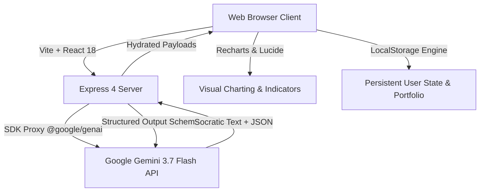

<div align="center">

# 📈 StockMentor AI — Socratic Market Intelligence & Trading University

<p align="center">
  <a href="https://stock-mentor-virid.vercel.app/">
    
  </a>
</p>

[](https://stock-mentor-virid.vercel.app/)
[](https://react.dev/)
[](https://www.typescriptlang.org/)
[](https://tailwindcss.com/)
[](LICENSE)

<br/>

### 🌐 **Live Application**
### 👉 **[https://stock-mentor-virid.vercel.app/](https://stock-mentor-virid.vercel.app/)** 👈

*Experience interactive Socratic tutoring, real-time technical chart breakdowns, and live market paper trading in your browser.*

---

</div>

## 📌 Executive Summary

**StockMentor AI** is an institutional-grade financial education ecosystem and interactive trading laboratory. Powered by **Google Gemini 3.7 Flash**, StockMentor shifts retail investors from passive rote learning into active deductive mastery through Socratic questioning, real-time technical chart breakdowns, behavioral trading journals, and risk-calibrated crash simulations.

---

## 🌟 Key Highlights & Feature Matrix

<table>
  <tr>
    <td width="50%">
      <h3>🧠 Socratic AI Tutor</h3>
      <ul>
        <li><b>3 Pedagogical Modes:</b> 🧒 ELI5 (intuitive analogies), 🟢 Simple (practical definitions), and 🔷 Professional (quant & institutional metrics).</li>
        <li><b>Interactive Diagrams:</b> Dynamic visualizations for candlesticks, breakouts, P/E ratios, cash flows, and order books.</li>
        <li><b>Context-Aware Memory:</b> Maintains dialogue state across multi-turn trading analyses.</li>
      </ul>
    </td>
    <td width="50%">
      <h3>📊 Technical Chart & Pattern Lab</h3>
      <ul>
        <li><b>Multi-Timeframe Engine:</b> 1D, 1W, 1M, and 1Y charts with responsive indicators.</li>
        <li><b>Technical Overlays:</b> 20 SMA, 50 EMA, 14 RSI, and Volume Profile distribution.</li>
        <li><b>AI Chart Explainer:</b> Instant technical thesis generated directly by Gemini 3.7 Flash.</li>
      </ul>
    </td>
  </tr>
  <tr>
    <td width="50%">
      <h3>💼 Real-Time Paper Trading</h3>
      <ul>
        <li><b>₹10,00,000 Virtual Capital:</b> Realistic execution simulation for long & short positions.</li>
        <li><b>Automated P&L & Margins:</b> Real-time mark-to-market calculations and portfolio weighting.</li>
        <li><b>Trade Execution History:</b> Complete timestamped audit trail with return analytics.</li>
      </ul>
    </td>
    <td width="50%">
      <h3>🌪️ Market Survival & Crash Labs</h3>
      <ul>
        <li><b>Historical Crises:</b> Relive the 2008 Financial Crisis, 2020 Covid Flash Crash, and Dot-com bubble.</li>
        <li><b>Decision Points:</b> Test risk tolerance under extreme volatility and liquidity crunches.</li>
        <li><b>Capital Preservation Metrics:</b> Measure Max Drawdown, Sharpe Ratio, and recovery speed.</li>
      </ul>
    </td>
  </tr>
  <tr>
    <td width="50%">
      <h3>🔬 Equity Research Terminal</h3>
      <ul>
        <li><b>7-Part Institutional Breakdown:</b> Moat analysis, ROIC, margin trajectories, bull/bear cases.</li>
        <li><b>Structured JSON Generation:</b> Type-safe financial data extraction via Gemini 3.7 Flash.</li>
        <li><b>Investor Checklist:</b> Actionable criteria prior to deploying simulated capital.</li>
      </ul>
    </td>
    <td width="50%">
      <h3>🧬 Behavioral DNA & Journal</h3>
      <ul>
        <li><b>Cognitive Bias Detection:</b> Flags FOMO entries, revenge trading, and premature profit-taking.</li>
        <li><b>Strategy DNA Profiler:</b> Uncovers your highest win-rate setups and optimal holding times.</li>
        <li><b>Continuous Diagnostics:</b> Highlights weak topics for focused revision.</li>
      </ul>
    </td>
  </tr>
</table>

---

## 🚀 Live Demo & Quick Launch

Experience the deployed application on Vercel:

```bash
# Visit the live application in any web browser
https://stock-mentor-virid.vercel.app/
```

- ⚡ **Zero-Install Instant Access:** Fully responsive on desktop, tablet, and mobile.
- 🔒 **Client-Safe Architecture:** All AI operations proxy through server-side endpoints to keep credentials secure.

---

## 🛠️ Architecture & Tech Stack



- **Frontend:** React 18, TypeScript, Tailwind CSS, Lucide Icons, Recharts, Motion.
- **Backend:** Node.js, Express, TypeScript (`tsx` dev runner, `esbuild` production bundler).
- **AI Intelligence:** `@google/genai` TypeScript SDK with model `gemini-3.7-flash`.
- **Deployment:** Vercel / Cloud Run container ready (`PORT=3000`, `0.0.0.0`).

---

## 💻 Local Development & Setup

### 1. Clone the Repository
```bash
git clone https://github.com/garvshaw89-glitch/stock-mentor.git
cd stock-mentor
```

### 2. Install Dependencies
```bash
npm install
```

### 3. Configure Environment Variables
Create a `.env` file in the project root:
```env
# Google Gemini API Key
GEMINI_API_KEY="your_gemini_api_key_here"

# App Deployment URL (Optional)
APP_URL="https://stock-mentor-virid.vercel.app/"
```

> **Note:** Obtain your Gemini API key from [Google AI Studio](https://aistudio.google.com/).

### 4. Run Development Server
```bash
npm run dev
```
Open [http://localhost:3000](http://localhost:3000) in your browser.

### 5. Production Build
```bash
npm run build
npm start
```

---

## 📂 Project Structure

```
├── .env.example              # Environment variable declaration template
├── index.html                # HTML entry point with metadata tags
├── metadata.json             # AI Studio platform configuration
├── package.json              # Project dependencies and build scripts
├── README.md                 # Project documentation & GitHub animated README
├── server.ts                 # Express backend proxying Gemini 3.7 Flash
├── src/
│   ├── App.tsx               # Main application routing & theme state
│   ├── components/
│   │   ├── ChartsModule.tsx  # Interactive technical indicators & pattern lab
│   │   ├── Header.tsx        # Brand banner, live link badge, search & theme
│   │   ├── HomeDashboard.tsx # Executive overview & quick launch pads
│   │   ├── LearnModule.tsx   # Stock market university curriculum
│   │   ├── Navigation.tsx    # Responsive desktop & mobile tab navigation
│   │   ├── ReadmeModule.tsx  # In-app interactive animated README viewer
│   │   ├── ResearchModule.tsx# Institutional equity research powered by Gemini
│   │   ├── SimulatorModule.tsx# ₹10L paper trading portfolio engine
│   │   ├── SocraticDrawer.tsx# Multi-depth Socratic AI tutor drawer
│   │   └── ...               # Additional specialized simulations & labs
│   ├── data/                 # Stock databases, lesson curricula, and quizzes
│   ├── types.ts              # TypeScript domain types and schemas
│   └── utils/                # State persistence & financial math utilities
```

---

## 🛡️ Educational Disclaimer

StockMentor AI is built solely for **educational and simulated pedagogical purposes**. Market scenarios, paper trading balances, AI research analyses, and Socratic feedback do not constitute financial, investment, legal, or tax advice. Always conduct independent due diligence before committing real capital.

---

<div align="center">

**StockMentor AI** • Socratic Market Intelligence  
Live Project: [https://stock-mentor-virid.vercel.app/](https://stock-mentor-virid.vercel.app/)

⭐ Star this repository if you find it helpful for trading education!

</div>
